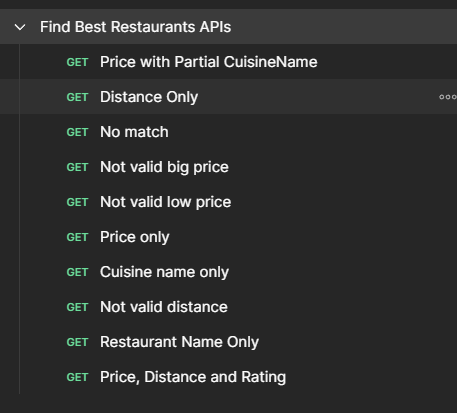

# 🍽 Restaurant Matcher API

This project is a Java Spring Boot backend application that finds the best restaurants based on user-defined filters such as name, cuisine, distance, price, and customer rating.

It loads initial data from CSV files into an in-memory H2 database and exposes a REST API to query and rank restaurants.

---

## Architecture Overview

The application follows a layered design:


Main components:

- **Controller** – Exposes REST endpoints.
- **Service** – Orchestrates filtering, sorting, and limiting logic.
- **Repository (JPA)** – Access to H2 database.
- **Filters** – Dynamic predicate building based on request parameters.
- **DTO / Mapper** – Separates API models from persistence models.
- **Liquibase** – Creates schema and loads CSV data.
- **H2** – In-memory database for simplicity and portability.

---

## Design Decisions

- **Spring Boot + Maven** for simplicity and standard enterprise structure.
- **H2 in-memory database** so no external setup is required.
- **Liquibase** to create tables and load CSV data automatically.
- **DTO mapping** to avoid exposing JPA entities.
- **Predicate-based filtering** to allow flexible and extensible filters.
- **Comparator chaining** to control ranking logic.
- **Stream API** for readable data processing pipeline.

---
✅ Assumptions:

- Filtering is performed in memory for simplicity and clarity.

- All filters are optional and composable.

- Validation ensures numeric ranges are respected before filtering.

- Ranking rules are centralized in the FilterLogic enum.

- Adding a new filter requires only adding a new enum entry and one condition in the predicate builder
---

🔍 Filtering and Ranking Strategy

The Restaurant Matcher API allows clients to search for restaurants using optional filters and returns the best matches ranked by business rules.

✅ Filtering

All filters are optional. The API dynamically builds a predicate based on the parameters provided in the request.

Supported filters:

```
| Field            | Description           | Rule                            |
|------------------|-----------------------|---------------------------------|
| restaurantName   | Restaurant name       | Case-insensitive partial match  |
| cuisineName      | Cuisine type          | Exact match                     |
| distance         | Distance from user    | Less than or equal to the value |
| price            | Price per person      | Less than or equal to the value |
| customerRating   | Rating                | Greater than the value          |
```

Instead of writing multiple query methods, the system uses a composable predicate approach:

- A base predicate always evaluates to true.
- Each non-null request parameter adds an extra predicate using logical AND.
- All predicates are applied in-memory after mapping entities to DTOs.

This makes the filter logic flexible, readable, and easy to extend.

-----
✅ Ranking (Sorting)

After filtering, results are ordered using a chained comparator strategy.

Current ranking priority:

1. Distance (ascending — closer first)

2. Customer Rating (descending — higher rated first)

3. Price (ascending — cheaper first)

4. Restaurant Name (alphabetical)

```
.sorted(FilterLogic.DISTANCE.getComparator()
.thenComparing(FilterLogic.CUSTOMER_RATING.getComparator())
.thenComparing(FilterLogic.PRICE.getComparator())
.thenComparing(FilterLogic.NAME.getComparator()))
```
This ensures the best matches appear at the top of the result list while preserving deterministic ordering.

----------
## Data Initialization

On startup:

- Tables are created using Liquibase.
- CSV files are loaded into H2.
- IDs are auto-generated for restaurants.
- Cuisine is referenced via `cuisine_id`.

This allows the project to run with no manual database setup.

---

📦 Database Management with Liquibase

This project uses Liquibase to manage database schema and seed data in a versioned and repeatable way.

Liquibase automatically applies database changes on application startup, ensuring all environments run with the same structure and initial data.

Why Liquibase?

- Keeps database changes under version control.
- Applies migrations automatically.
- Ensures consistent setup for local, test, and CI environments.
- Avoids manual SQL initialization.

This makes the application ready to run without extra database configuration.

---------------

## How to Run Backend

Requirements:

- Java 17+
- Maven

Run:

```bash
mvn clean spring-boot:run
```` 
-----

or it's possible to run the jar file:

```
mvn clean package
```

then

```
curl "http://localhost:8080/api/restaurants?cuisineName=Italian&distance=5&price=40&customerRating=3"
```

## 🧪 API Testing with Postman

This project includes a ready-to-use Postman collection to validate the API behavior using different filter and ranking scenarios.

You can find it under:

```
/src/test/resources/expected-responses
```

Make sure application is running.

The collection focuses on the single available endpoint and exercises it with multiple combinations of query parameters (name, cuisine, distance, price, rating, etc.).

What it Covers

- Different filter combinations.
- Boundary cases for distance, price, and rating.
- Sorting and ranking validation.
- Response structure validation.

Simply import the collection into Postman and run the requests to explore the API behavior.

It should look like this:



---------------------------
## API testing with curl commands

Base Request

```
curl "http://localhost:8080/api/restaurants"
```

Filter by Cuisine
```
curl "http://localhost:8080/api/restaurants?cuisineName=Italian"
```

Filter by Distance and Price
```
curl "http://localhost:8080/api/restaurants?distance=5&price=30"
```

Combine Multiple Filters
```
curl "http://localhost:8080/api/restaurants?cuisineName=Italian&distance=5&price=40&customerRating=3"
```

